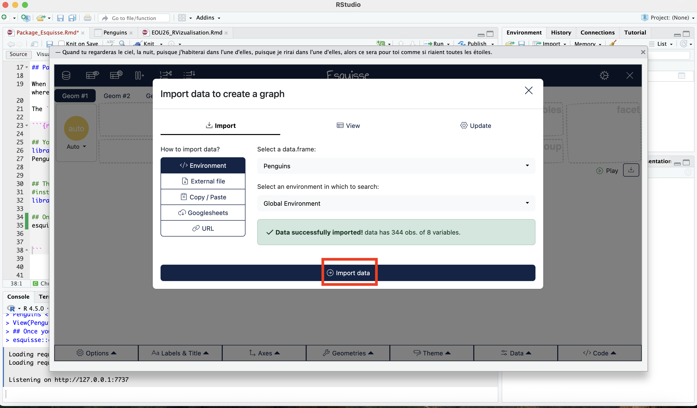
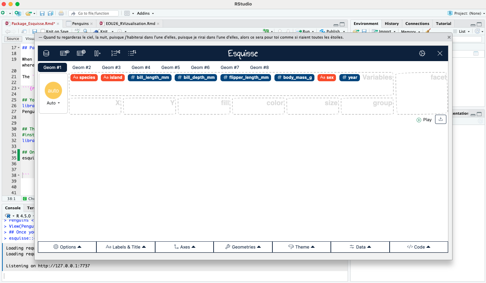
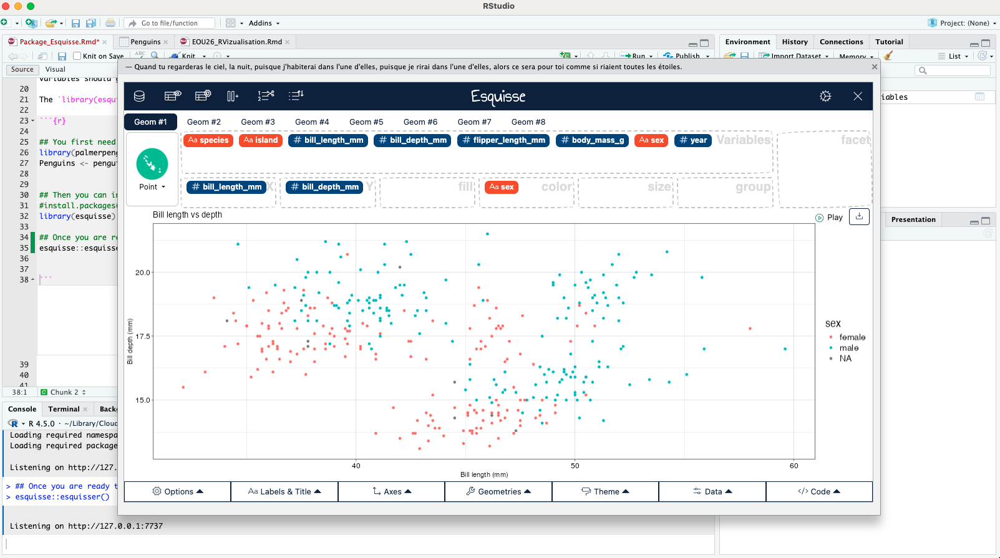
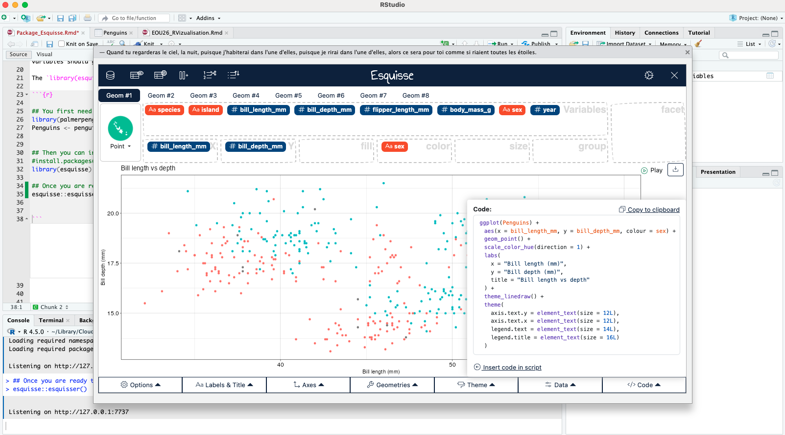

```{r setup, include=FALSE}
knitr::opts_chunk$set(eval = FALSE)
```

## Package esquisse to get started with ggplot

When you first start learning how to plot in Rstudio using `library(ggplot2)`. It can be hard to understand how to write the code, where your variables should go and where the parameter to adjust the plot should go as well. 

The `library(esquisse)` was created to make the first step in `library(ggplot2)` less daunting. Let's see how it works


You will first need to import a data set in your Environment
`library(palmerpenguins)`
`Penguins <- penguins`

Then install and download the library:
`install.packages("esquisse")`
`library(esquisse)`

Finally, open the function that will help to to plot your data:
`esquisse::esquisser()`

This function will open the following window:


You can then press on "Import data", the different variables available in your data set are now appearing, in the top part of the `esquisser()`, in the box **variable**:



You can drag the variables in the different boxes: x, y, fill, color, size, group to build your plot:


You can change how the labels, the titles, the axes, the plot is display buy playing with the setting at the bottom of the `esquisser()`

Finally, you can extract the code and see how it is written if you were directly using ggplot by clicking on the Code section at the bottom right side of `esquisser()`


Now is your time to try it out
```{r}

## You first need to import a data set in your Environment
library(palmerpenguins)
Penguins <- penguins


## Then you can install and download the library
#install.packages("esquisse")
library(esquisse)

## Once you are ready to plot your data, you can run this piece of code:
esquisse::esquisser() 
```
